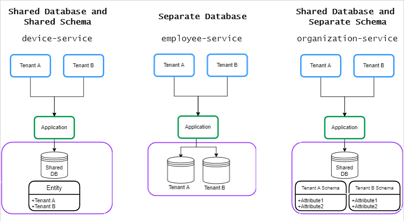

# multitenancy-microservices

> Spring Boot backend architecture demo для сравнения multi-tenancy strategies в микросервисах.


[English version](README.md)

| Поле | Значение |
|---|---|
| Статус | Sandbox-демо backend-архитектуры |
| Тип | Spring Boot microservices / multi-tenancy demo |
| Основной stack | Java 21, Spring Boot 3.3.1, Spring Cloud 2023.0.2, PostgreSQL 15, Consul, Docker Compose |
| Сервисы | `employee-service`, `organization-service`, `device-service`, `tenant-service` |
| Стиль API | REST с tenant-aware headers на domain services |
| Quick verify | `./gradlew build` |
| Уровень проверки | Manifest-verified; commands documented, not rerun during README rollout |

## Назначение

- Показать несколько подходов к tenant data isolation в Spring Boot microservice system.
- Сохранить явные service boundaries при использовании local service discovery и PostgreSQL-backed demo data.
- Зафиксировать sandbox learning project, а не hardened production deployment.

Публичный repository path сейчас содержит историческую опечатку `multitenacy-microservices`; project name, README title и Gradle root project используют исправленное написание `multitenancy-microservices`.

## Runtime-среда

| Компонент | Значение | Источник |
|---|---|---|
| Java | 21 via Gradle toolchain | `*/build.gradle` |
| Gradle wrapper | 8.6 at repository root | `gradle/wrapper/gradle-wrapper.properties` |
| Spring Boot | 3.3.1 | `*/build.gradle` |
| Spring Cloud | 2023.0.2 | `*/build.gradle` |
| База данных | PostgreSQL 15 Alpine containers | `docker-compose.yml` |
| Service discovery | HashiCorp Consul 1.10.0 | `docker-compose.yml` |
| Наблюдаемость | Spring Boot Actuator, Micrometer Prometheus registry | `*/build.gradle`, `*/application.yml` |

## Архитектура

Репозиторий содержит четыре Spring Boot services и локальную инфраструктуру для tenant-aware backend design:

| Модуль | Ответственность | Tenant model | Default port |
|---|---|---|---|
| `employee-service` | Employee API и employee data | Database per tenant | `8081` |
| `organization-service` | Organization API и organization data | Schema per tenant | `8082` |
| `device-service` | Device API и demo device data | Tenant column / Hibernate tenant id | `8083` |
| `tenant-service` | Tenant metadata registry | Shared tenant catalog | `8084` |



## Структура репозитория

- `employee-service/` - employee API, Feign integration и per-tenant datasource configuration.
- `organization-service/` - organization API, schema-based tenant configuration и tenant-aware cache coverage.
- `device-service/` - device API, persistence layer и tenant-column isolation.
- `tenant-service/` - tenant registry API и Flyway-backed tenant metadata storage.
- `consul/` - конфигурация Consul server и client.
- `init/` - PostgreSQL initialization scripts для demo databases.
- `assets/` - architecture image и supporting repository assets.
- `docker-compose.yml` - локальный PostgreSQL и Consul stack.

## API surface

| Сервис | Routes | Tenant requirement |
|---|---|---|
| `employee-service` | `/api/v1/employee`, `/api/v1/employee/{id}` | Требует `X-TenantID` |
| `organization-service` | `/api/v1/organization`, `/api/v1/organization/{id}` | Требует `X-TenantID` |
| `device-service` | `/api/v1/device`, `/api/v1/device/{id}` | Требует `X-TenantID` |
| `tenant-service` | `/api/v1/tenant`, `/api/v1/tenant/{id}` | Tenant registry; tenant header requirement в коде не документирован |
| Все services | `/actuator/health`, `/actuator/info`, `/actuator/metrics`, `/actuator/prometheus` | Actuator routes exempt from tenant headers |

Отсутствующие или пустые `X-TenantID` headers на tenant-aware domain routes отклоняются с `400 Bad Request`.

## Локальный запуск

1. Скопируйте environment template и замените demo passwords перед публикацией или любым derived deployment:

```sh
cp .env.example .env
```

2. Запустите local dependencies:

```sh
docker compose up -d
```

3. Соберите и проверьте все services с JDK 21:

```sh
export JAVA_HOME=$(/usr/libexec/java_home -v 21) # пример для macOS
./gradlew build
# Если executable bit недоступен: sh ./gradlew build
```

Application runtime использует Consul и PostgreSQL из Docker Compose. Test profiles отключают Consul/discovery, а tenant isolation tests используют Testcontainers там, где это настроено.

4. Запустите отдельный service против local stack:

```sh
SPRING_PROFILES_ACTIVE=local ./gradlew :employee-service:bootRun
```

5. Проверьте отдельные modules:

```sh
./gradlew :employee-service:test
./gradlew :organization-service:test
./gradlew :device-service:test
./gradlew :tenant-service:test
```

## Локальные порты

| Компонент | Port(s) | Примечания |
|---|---:|---|
| `employee-service` | `8081` | Spring Boot service |
| `organization-service` | `8082` | Spring Boot service |
| `device-service` | `8083` | Spring Boot service |
| `tenant-service` | `8084` | Spring Boot service |
| Consul UI/API | `8500` | Docker Compose |
| Consul DNS | `8600/tcp`, `8600/udp` | Docker Compose |
| employee tenant 1 DB | `65431` | PostgreSQL container |
| employee tenant 2 DB | `65432` | PostgreSQL container |
| organization DB | `65433` | PostgreSQL container |
| device DB | `65434` | PostgreSQL container |
| tenant DB | `65435` | PostgreSQL container |

## Профили конфигурации

- Default profile: общие настройки сервисов — service name, port, JPA dialect, actuator exposure и demo-safe environment placeholders.
- `local` profile: local Docker Compose endpoints и переопределяемые datasource/Consul variables.
- `test` profile: отключает Consul/discovery и database health checks для lightweight context и actuator smoke tests. В `tenant-service` этот профиль также отключает Flyway, если конкретный integration test не переопределяет это явно.

Основные local variables:

- `POSTGRES_PASSWORD` - Docker Compose PostgreSQL password.
- `DB_PASSWORD` - shared demo database password, используемый services при отсутствии service-specific overrides.
- `CONSUL_HOST`, `CONSUL_PORT` - local Consul endpoint overrides.
- Service-specific overrides вроде `EMPLOYEE_TENANT_1_DB_URL`, `ORGANIZATION_DB_URL`, `DEVICE_DB_URL` и `TENANT_DB_URL` доступны в соответствующих `application-local.yml`.

## Tenant routing и isolation tests

Tenant isolation покрыта integration и controller tests:

- `employee-service` проверяет database-per-tenant routing через Testcontainers и fail-closed поведение для unknown tenants без fallback на default datasource.
- `organization-service` проверяет schema-per-tenant isolation через Testcontainers и содержит tenant-aware cache regression test.
- `device-service` проверяет tenant-column isolation.
- `employee-service`, `organization-service` и `device-service` controller tests проверяют tenant header validation на API routes.

## Наблюдаемость

Каждый service публикует минимальный Spring Boot Actuator baseline:

- `/actuator/health` и probe groups для health checks.
- `/actuator/info` для service metadata.
- `/actuator/metrics` для Micrometer metrics.
- `/actuator/prometheus` для Prometheus scraping.

Набор опубликованных actuator endpoints управляется через `ACTUATOR_ENDPOINTS` и по умолчанию равен `health,info,metrics,prometheus`.
Каждый service также пишет одну structured `http_request` log line на request: method, URI, status и duration.

## Ограничения / безопасность

- Только sandbox project; authentication/authorization layer не документирован для public production use.
- Demo passwords являются placeholders и должны быть заменены для любой реальной среды.
- Tenant isolation patterns намеренно смешаны для сравнения, это не единый recommended production blueprint.
- Перед адаптацией вне local demo нужно отдельно проверить database migrations, tenant provisioning, observability и auth.

## Статус

Демо backend-архитектуры. Репозиторий опубликован как reference implementation для service boundaries, runtime wiring и configuration hygiene; он не поддерживается как production-ready product.
